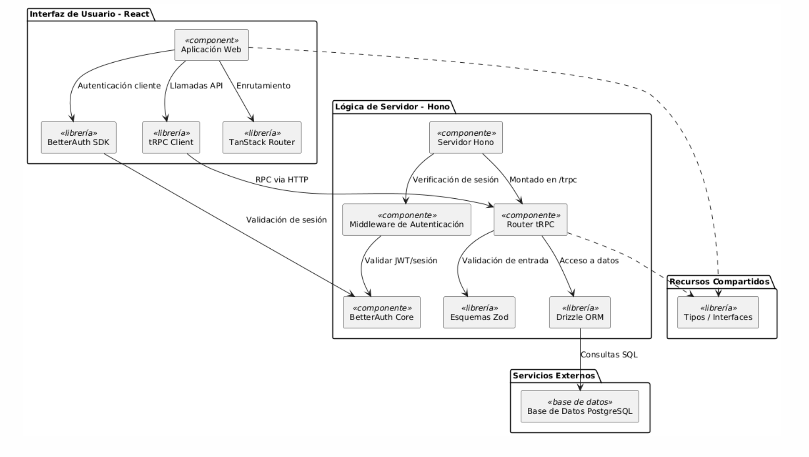

<div align="center">
  

  <h1>Truckly</h1>
  <p>Gestión inteligente y simplificada de flotas vehiculares empresariales.</p>
</div>

---

## 🚚 ¿Qué es Truckly?

**Truckly** es una plataforma web moderna para la gestión de flotas vehiculares orientada a pequeñas y medianas empresas. Su propósito es optimizar el control de vehículos corporativos, permitiendo llevar un registro detallado de:

- Conductores y usuarios del sistema.
- Vehículos disponibles y su historial.
- Asignaciones por período de tiempo.
- Mantenimientos preventivos y correctivos.

Todo esto mediante una interfaz intuitiva y segura, diferenciando el acceso y funciones por roles (administrador y conductor).

---

## 📝 Breve Guía de Uso

### 🚪 ¿Cómo ingresar a la aplicación?

Puedes acceder a Truckly desde el siguiente enlace desplegado en Netlify:

👉 [https://truckly.netlify.app/](https://truckly.netlify.app/)

Para utilizar y probar las funcionalidades, inicia sesión con cualquiera de los usuarios de prueba listados más abajo. Recuerda: es necesario iniciar sesión para acceder a las funciones, ya que la plataforma implementa autenticación robusta.

---

### 🔐 ¿Cómo cerrar sesión?

Para cerrar sesión en la plataforma, ya sea desde el panel de administrador o el panel de conductor, sigue estos pasos:

    Ubica tu nombre de usuario:
    Una vez hayas iniciado sesión, tu nombre de usuario aparecerá en:
     la esquina superior derecha de la pantalla (CONDUCTORES).
     La esquina inferior izquierda de la pantalla (ADMINISTRADORES)

    Haz clic izquierdo sobre tu nombre:
    Al hacer clic sobre tu nombre, se desplegará un pequeño menú.

    Selecciona “Cerrar sesión”:
    En este menú, encontrarás el botón Cerrar sesión. Haz clic en él para salir de tu cuenta de manera segura.

Este flujo es igual para ambos roles (administrador y conductor).

### ⚙️ Funcionalidades a Probar

#### 👤 Para Administradores

- Registro de conductores y usuarios.
- Registro, edición y eliminación de vehículos.
- Asignación de vehículos a conductores.
- Gestión de asignaciones y mantenimientos de los vehículos.

#### 🚗 Para Conductores

- Visualización de su vehículo asignado.
- Ver sus asignaciones.
- Editar el estado de sus asignaciones.

---

### 🧑‍💼 Roles y Usuarios de Prueba

La plataforma cuenta con dos roles principales: **Administrador** y **Conductor**.

- **Usuarios Conductores:**
  - `jcantero@truckly.cl`
  - `arepa@truckly.cl`
  - `amarillo@truckly.cl`
- **Usuarios Administradores:**
  - `jmunoz@truckly.cl`
  - `fvaldes@truckly.cl`

**Contraseña de prueba para todos:**  
`123456789`

> ⚠️ **Importante:** Para probar todas las funcionalidades, es obligatorio iniciar sesión. Esto es parte del sistema de seguridad integrado, que puedes revisar en detalle en la sección de tecnologías utilizadas.

---

## 🧱 Arquitectura del Proyecto

Truckly se construye bajo una arquitectura moderna basada en tecnologías fullstack con tipado estático. A continuación se muestra el diagrama de componentes que detalla la interacción entre cada parte del sistema:



### 🧩 Tecnologías utilizadas

| Capa          | Tecnología               | Descripción                                         |
| ------------- | ------------------------ | --------------------------------------------------- |
| Frontend      | React + Vite             | Interfaz moderna con enrutamiento (TanStack Router) |
| Backend       | Hono + tRPC              | API tipo-safe, ligera y modular                     |
| Autenticación | BetterAuth               | Validación de sesiones y control de roles           |
| Base de Datos | PostgreSQL + Drizzle ORM | Modelado relacional y migraciones tipadas           |
| Validación    | Zod                      | Validación estricta de entradas (DTO)               |

---

## ⚙️ Instalación y desarrollo

### Requisitos

- [Bun](https://bun.sh/) ≥ 1.0

### Pasos

```bash
# 1. Clona el repositorio
git clone https://github.com/vcntttt/truckly.git
cd truckly

# 2. Instala dependencias
bun install

# 3. Configura variables de entorno agregando base de datos y claves de BetterAuth
cp .env.example .env

# 4. Setea la base de datos
cd apps/server
bunx run db:push
bunx run db:seed

# 5. Inicia la app
cd ../
bun dev

# 5.1 Iniciar apps por separado
bun run client:dev
bun run server:dev
```
